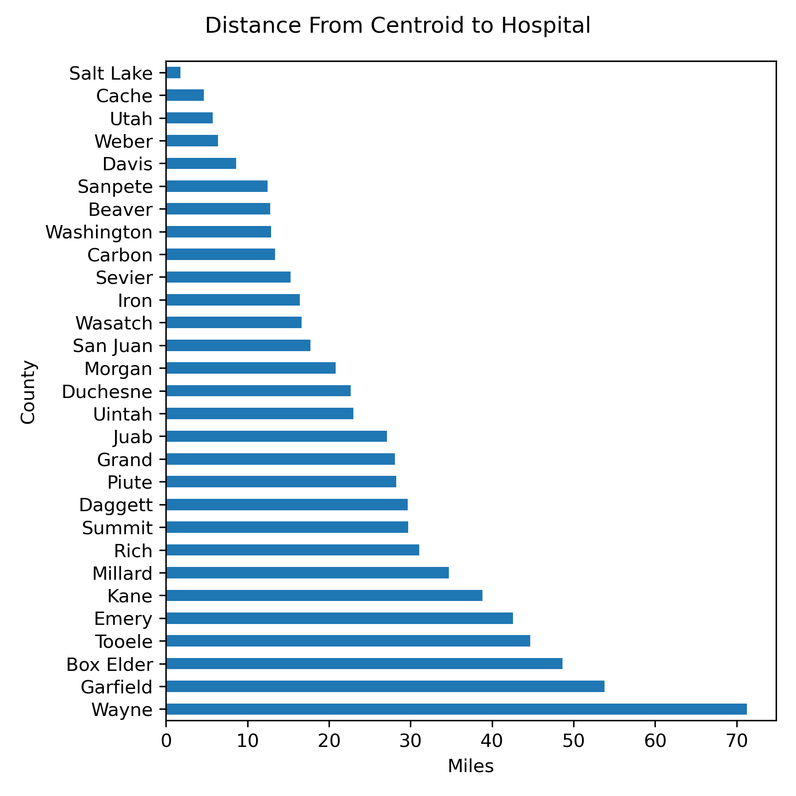

# Hospital Locations and Deaths as the Result of Accidents In Utah

What is the relationship between the distance to the nearest hosptial and deaths as a result of accidents in Utah? 

## Summary:

One of the topics gaining attention in the Utah Legislature is the difference in outcomes between those living in Northern 
Utah (particularly along the Wasatch Front) and those living in Southern Utah. The Wasatch Front is a set of four counties
that collectively account for 75% of Utah's population: Salt Lake County, Davis County, Weber County, and Utah County. Since
a large portion of services are concentrated in these counties, I wanted to examine the relationship between distance to the 
nearest hospital and deaths as a result of accidents as a percentage of population for each county.

This project takes advantage of CDC Wonder, a collection of data compiled by the CDC that contains 
mortality and population counts for all U.S. counties, as well as causes of death. I retrieved all 
deaths that resulted from external causes for all Utah counties from 1999-2020. Because the output 
aggregates death counts and population totals for each county, I divided both by 22 to 
get yearly average deaths as a result of external causes and yearly average population. I retrieved two shapefiles from the Utah Geospacial Resource Center: a file containing all healthcare facilities in Utah and county boundary shapefile. I then used QGIS to calculate the distance from 
the centroid of each county to the nearest hospital. 

## Data Locations:
- Visit https://wonder.cdc.gov/ucd-icd10.html to retrieve cause of death data from the CDC
- Visit the Utah Geospatial Resource Center at https://gis.utah.gov/data/boundaries/citycountystate/
to retrieve the county shapefile, and at https://gis.utah.gov/data/health/health-care-facilities/ to 
retrieve the shapefile with all healthcare facilities in Utah.

## Instructions: 

1. Import and edit Utah_heath_Care_Facilities.zip to keep only the NAME, TYPE, and geometry columns,
then filter to remove all healthcare facilities from the list besides hospitals. After that, save the 
file as a geopackage so it can be used in QGIS. 

2. In QGIS import the hospital shapefile, the county shapefile, and use centroids to calculate
the distance from the center of each county to the nearest hospital. Save the layer to be used in Python

3. Import the accident information Underlying_Cause_of_Death, and edit the file to remove
extra text, and keep only the County, County Code, Deaths, and Population columns. Save years as 2020-1998 to get the number of data years, then divide deaths and population by years to get the average yearly deaths and average yearly
population. 

4. Import layer lines and divide distance by 1609.344 to change meters to miles

5. Create plots, including barh plot to show difference in deaths as a reuslt of accidents in each
county, barh plot showing distance to nearest hospital in miles for each county, scatterplot
showing relationship between deaths and distance to the nearest hospital, and a regression plot to model the statistical significance. 

## Results and Analysis

1. There are significant differences in hospital access

One of the major takeaways from this project is the major difference in hospital distances
across the state. Those living in Wayne county have to travel over 70 miles to reach their
nearest hospital, while those living in Salt Lake County have to travel just over a mile. 

2. There are major differences in death rates 

There was a surprising difference in death rates as a result of accidents across counties.
The death rate as a result of accidents was almost three times higher in Carbon county than
in Cache county. It's also interesting to note that the county with the furthest distance to
a hopspital (Wayne County) is not the county with the highest death rate as a result of accidents: that
distinciton belongs to Carbon county. One potential explanation for this is the extensive 
mining that occurs there. The veritcal line shows the average death rate across the state as a result of acidents, allowing for county comparison to the state average. 

3. The relationship between death rates and proxmity to hospitals is statistically significant.

When regressing effect of hospital distance on deaths a result of accidents, the result is statistically significantly different from zero at the 95% confidence level. 

Regression results: 

Intercept: 0.06739642206850958

Slope: 0.0005651950096873863

P-value: 0.023152060209933385

Standard Error: 0.00023473730829918604

In other words, for every mile that an individual has to travel to get to a hospital, the percentage chance of death increases by 0.0565%

**Policy Implications**

This script provides a tool to examine the relationship between hosptial distance and death
rates as a result of accidents. The relationship between the speed with which a person receives treatment after an accident and their potential for surviving seems intuitive, and is well documented.(see article) This simple model is a way to visualize that relationship, identify the strength of the relationship, and measure the impact of distance on percentage chance of death as a result of accidents. 
https://www.ncbi.nlm.nih.gov/pmc/articles/PMC2464671/

